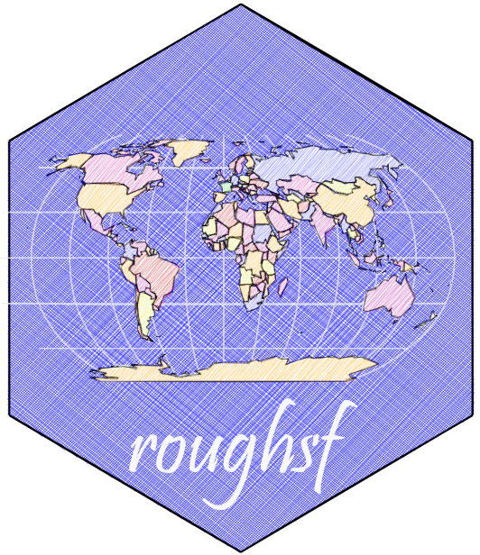
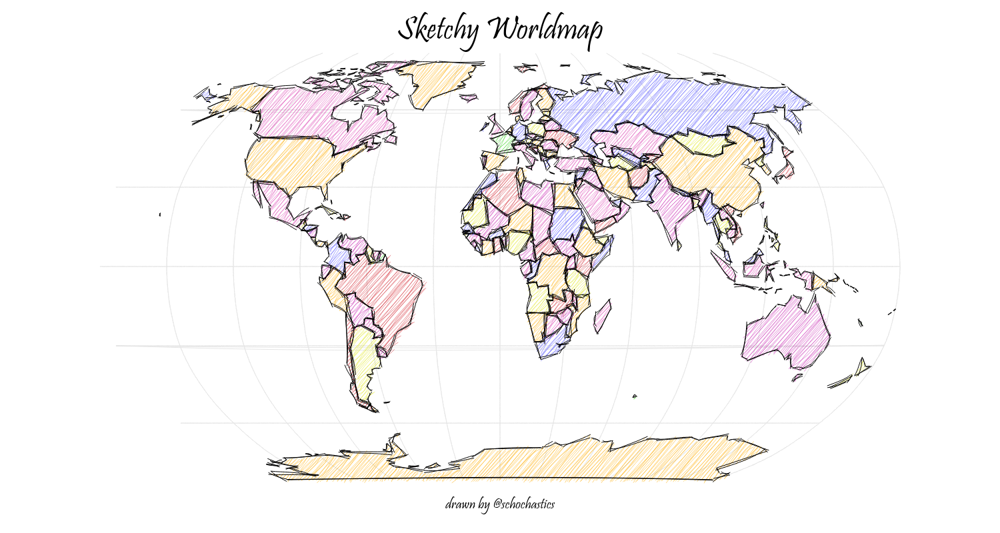
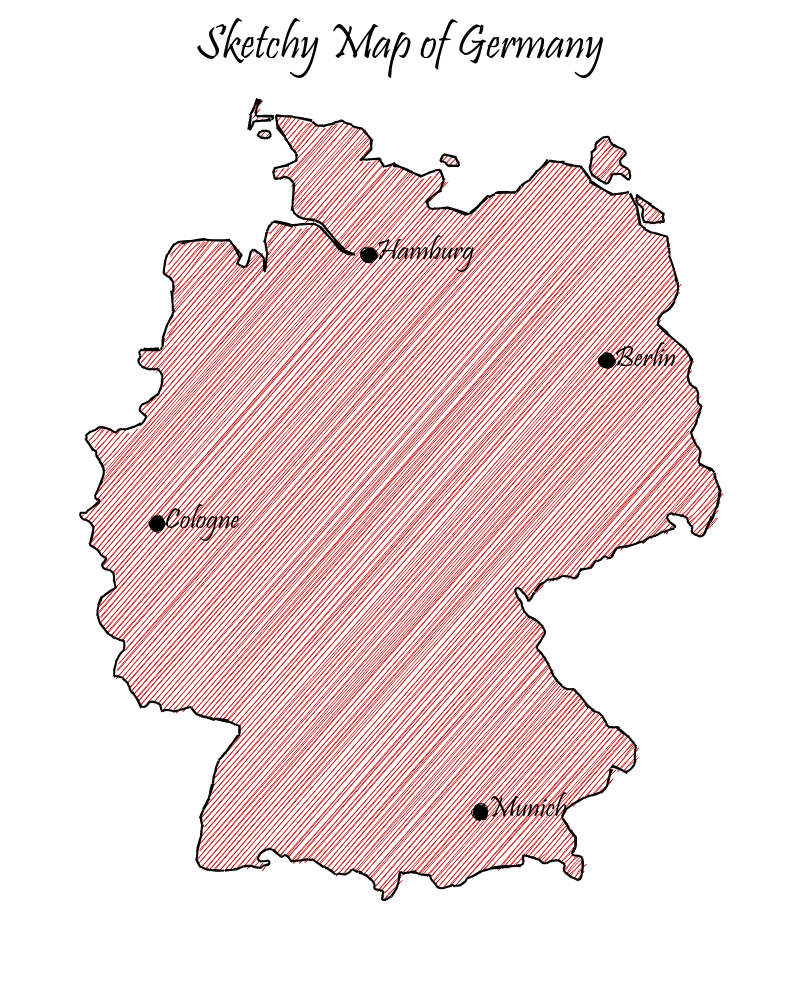
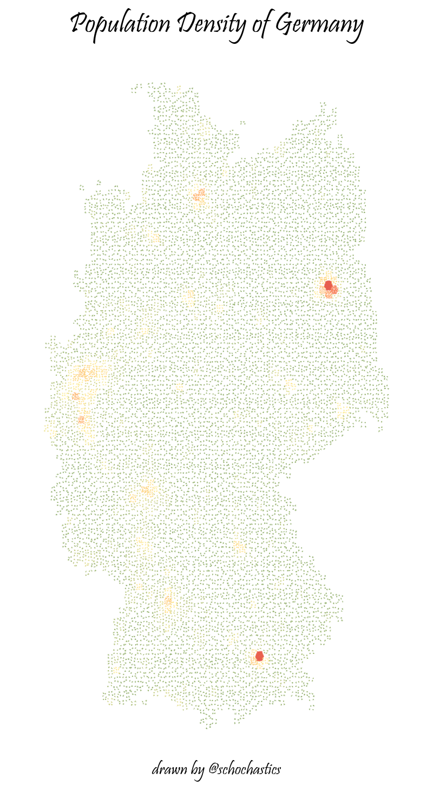

<!-- README.md is generated from README.Rmd. Please edit that file -->

# roughsf 

<!-- badges: start -->

[](https://github.com/schochastics/roughsf/actions)
[](https://CRAN.R-project.org/package=roughsf)
<!-- badges: end -->

Using the java script library [rough.js](https://roughjs.com/) to draw
sketchy, hand-drawn-like maps  
(*Checkout [ggrough](https://xvrdm.github.io/ggrough/) for turning
general ggplot objects into sketchy drawings and
[roughnet](https://github.com/schochastics/roughnet) for networks*)



## Installation

You can install the developers version of roughsf with:

``` r
# install.packages("remotes")
remotes::install_github("schochastics/roughsf")
```

## Usage

`roughsf()` takes a list of sf objects as input. The layers are drawn in
order as they appear in the list. MULTI\* geometries are not supported
and should be casted beforehand. Aesthetics need to be specified
explicitly as columns in the sf objects.

The following attributes are supported for POLYGONS:

-   *fill* fill color
-   *color* stroke color
-   *stroke* stroke size
-   *fillstyle* one of “hachure”, “solid”, “zigzag”, “cross-hatch”,
    “dots”, “dashed”, “zigzag-line”
-   *fillweight* thickness of fillstyle (between 0 and 1)
-   *hachureangle* angle of hachure lines
-   *hachuregap* gap between two hachure lines

The following attributes are supported for LINESTRINGS:

-   *color* stroke color
-   *stroke* stroke size

The following attributes are supported for POINTS:

-   *color* color of point
-   *size* size of point
-   *label* label to be added (optional)
-   *label_pos* position of label relative to point: (c)enter, (n)orth,
    (e)ast, (s)outh, (w)est (optional)

Default values are used if one of the attributes is not found.

**Values need to be specified explicitly and cannot be inferred from
other columns** (This needs to be done in a preparatory step)

``` r
library(sf)
ger <- rnaturalearth::ne_countries(scale = "medium", country = "Germany", returnclass = "sf")
ger <- st_cast(ger, "POLYGON")
ger$fill <- "#CD2626"
ger$stroke <- 2
ger$fillweight <- 0.5

# MULTIPOLYGON (and also MULTILINESTRING) are not supported
ger <- st_cast(ger, "POLYGON")

cities <- data.frame(name = c("Berlin", "Munich", "Hamburg", "Cologne"))
cities$geometry <- st_sfc(
  st_point(c(13.4, 52.5200)), st_point(c(11.582, 48.1351)),
  st_point(c(9.9937, 53.5511)), st_point(c(6.9603, 50.9375))
)
cities <- st_sf(cities)
st_crs(cities) <- "+proj=longlat +datum=WGS84 +no_defs +ellps=WGS84 +towgs84=0,0,0"
cities$size <- 15
cities$color <- "#000000"
cities$label <- cities$name
cities$label_pos <- "e"

roughsf::roughsf(list(ger, cities),
                 title = "Sketchy Map of Germany", caption = "drawn by @schochastics",
                 title_font = "48px Pristina", font = "30px Pristina", caption_font = "30px Pristina",
                 roughness = 1, bowing = 1, simplification = 1,
                 width = 800, height = 1000, 
)
```



Plots can be saved as png with the `save_roughsf()` function.

# More Examples



